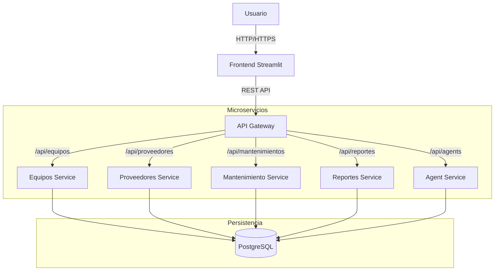
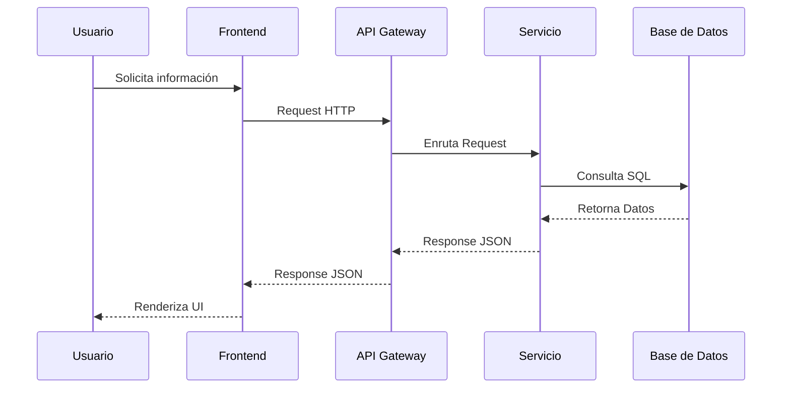

# Arquitectura del Sistema

## Diagrama de Arquitectura General



## Diagrama de Flujo de Datos



## Diagrama Entidad-Relación (Simplificado)

```mermaid
erDiagram
    EQUIPOS ||--o{ MOVIMIENTOS : tiene
    EQUIPOS ||--o{ MANTENIMIENTOS : recibe
    CATEGORIAS ||--o{ EQUIPOS : clasifica
    PROVEEDORES ||--o{ EQUIPOS : suministra
    PROVEEDORES ||--o{ CONTRATOS : firma
    UBICACIONES ||--o{ EQUIPOS : aloja
    UBICACIONES ||--o{ MOVIMIENTOS : origen/destino
```

## Componentes

1. **Frontend (Streamlit)**: Interfaz de usuario interactiva para gestión y visualización.
2. **API Gateway (FastAPI)**: Punto de entrada único, maneja enrutamiento y CORS.
3. **Equipos Service**: Microservicio core para inventario y trazabilidad.
4. **Proveedores Service**: Gestión de terceros y contratos.
5. **Mantenimiento Service**: Lógica de negocio para programación de tareas técnicas.
6. **Reportes Service**: Generación de dashboards y exportables.
7. **Agent Service**: Procesos en segundo plano para monitoreo proactivo.
8. **PostgreSQL**: Base de datos relacional centralizada.
